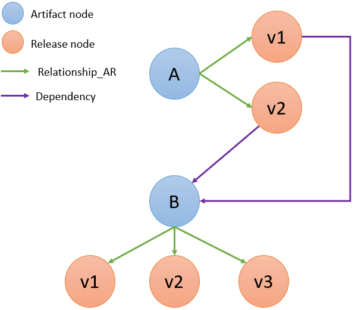

# Neo4j database
The dependency graph database is composed of two node types (for libraries and for their releases) and two edge types (from releases to their dependencies and from libraries to their releases). The nodes for libraries (type Artifact) contain the Maven id (g.a) information. The nodes for releases (type Release) contain the Maven id (g.a.v), the release timestamp, and the version information. The edges for dependencies (type dependency) are from Release nodes to Artifact nodes and contain target version (which can be a range) and scope (compile, test, etc). The edges for versioning (type relationship_AR) edges are from Artifact nodes to Release nodes.

The latest version of our dataset, dated April 12th, 2024, contains 14,077,982 nodes (625,472 libraries and 13,452,510 releases) and 123,652,903 edges (110,200,393 dependencies and 13,452,510 versioning edges).

## Neo4j Cypher querying

Here, we will presents basic examples of Cypher queries on the Neo4j Maven Central dependency graph.
Cypher is Neo4j’s declarative query language.

### Get a Release Node

### Get all Library versions

### Get Release dependencies

### Get Release dependents

