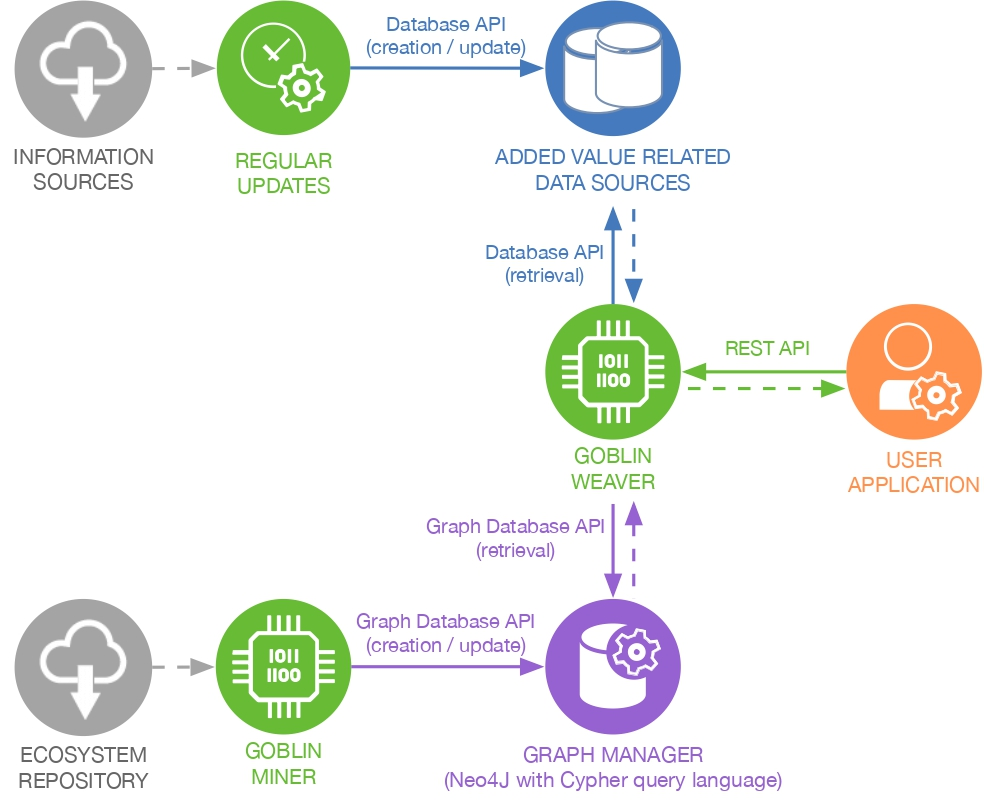

# goblinTutorial
A tutorial on how to use the datasets and tools from the Goblin ecosystem.

The Goblin framework (see Figure Below) is organized around a **Neo4J database** of the whole Maven Central dependency graph.
This database can be created and updated incrementally using **Goblin Miner**.
The database can be queried directly using Cypher (the Neo4j query language) or through the **Goblin Weaver** tool.

  

We give here some elements on the use of the Neo4J databases and the Weaver and Miner tools.

- [installing the data set and the tools](001_installation.md)

  This tutorial will help you in installing a Neo4J database for an ecosystem dependency graph.
  Several versions of such database dumps are provided (see link in the tutorial), either "raw" or with added metrics pre-computed and associated to the graph nodes.
  
- [using the Neo4J database](002_Neo4jDatabase.md)

  This tutorial will help you understand the dependency graph database structure and give some idea of the numbers of nodes/edges inside.
  It will also give examples of queries you can directly give (using Neo4J's Cypher query language) to the Neo4J engine.
  As for programmatic access to the database, one is referred to the Weaver source code that can me mimicked.
  
- [using and extending the Weaver tool](003_WeaverAPI.md)

  This tutorial explains how to use and extend the Weaver tool that is used to compute and retrieve parts of the dependency graph with added information on it.
  Some metrics are already supported by the Weaver (and included in some database dumps we provide) but one may extend it to include new ones.
  
- [regenerating a fresh dependency graph using the Miner](004_Miner.md)

  This tutorial is provided in case one wants to regenerate a fresh dependency graph database from scratch (e.g., a more up-to-date version wrt Maven Central).

- [Automatic and manual deletion, and populating the entire database with added values](005_AddedValues.md)

  This tutorial is provided to better understand how added values are automatically deleted from the database, how to manually delete them, and how to populate the database with added values.
